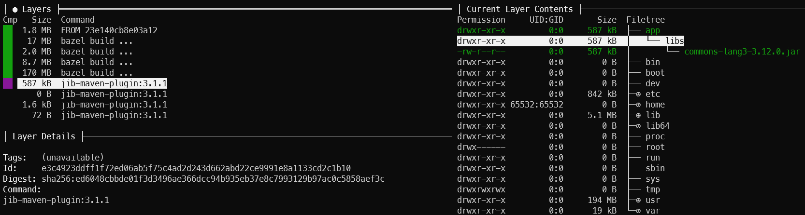
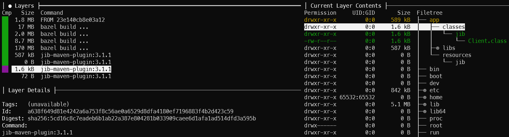

# Description
This repository contains a PoC about building Java images using [jib](https://github.com/GoogleContainerTools/jib)

* I am using a local Docker registry instance. More about it [here](https://hub.docker.com/_/registry). It listens at `localhost:5000`

* Also Java [distroless](https://github.com/GoogleContainerTools/distroless) base images are being used.

# Usage
## Build
```
mvn clean package
```
>...  
[INFO] Using base image with digest: sha256:69ac1ba2b76e5376487300e4a379f97306b30a6d693679d3af01cc6d8923360e  
[INFO]  
[INFO] Container entrypoint set to [java, -cp, @/app/jib-classpath-file, jib.Client]  
[INFO]  
[INFO] Built and pushed image as localhost:5000/jib:0.0.1-SNAPSHOT  
[INFO] Executing tasks:  
[INFO] > launching layer pushers  
...  

jib build goal is bind to `package` mvn lifecycle. See `pom.xml` for more details.

## Run
```
docker run --rm -it --name jib-poc -e sleep=1000 localhost:5000/jib:0.0.1-SNAPSHOT
```

# Inspecting the image
If we use [Dive](https://github.com/wagoodman/dive) to inspect the resulting image.

Each `jib-maven-plugin` layer is explained [here](https://github.com/GoogleContainerTools/jib/blob/master/docs/faq.md#how-are-jib-applications-layered)

Jib is not intended to be used as a `containerized jar`. It copies all resources in each layer, caching and making a fast image.

* Dependencies from `pom.xml` are being copied to /app/libs


* Classes are here


* Entrypoint
```
docker inspect --format='{{.Config.Entrypoint}}' localhost:5000/jib:0.0.1-SNAPSHOT
[java -cp @/app/jib-classpath-file jib.Client]
```

# Useful Links
* [Jib FAQ](https://github.com/GoogleContainerTools/jib/blob/master/docs/faq.md)
    * [Where is the application in the container filesystem](https://github.com/GoogleContainerTools/jib/blob/master/docs/faq.md#where-is-the-application-in-the-container-filesystem)

* [Build containers faster with Jib, a Google image build tool for Java applications](https://www.youtube.com/watch?v=H6gR_Cv4yWI) on YouTube